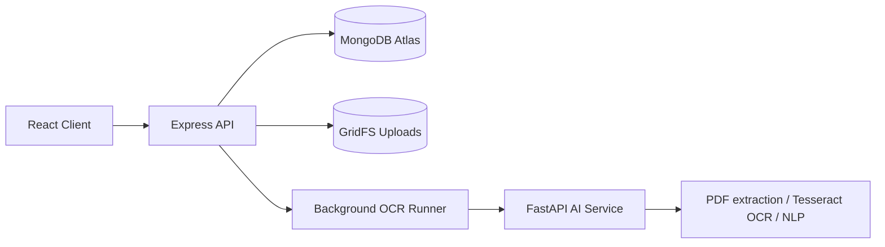

# PenBot AI Architecture

## Processing flow
Upload -> Save original in GridFS -> Background OCR -> Structure detection -> Store editable blocks -> Edit -> Search/Export

Original PDFs/images are stored in MongoDB GridFS, so preview and retry OCR continue to work after server restart or redeploy.
