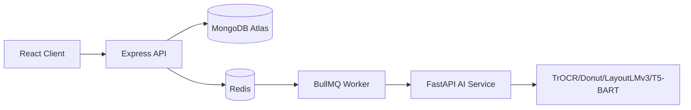

# PenBot AI Architecture

```mermaid
flowchart LR
A[React Client] --> B[Express API]
B --> C[(MongoDB Atlas)]
B --> D[(Redis)]
D --> E[BullMQ Worker]
E --> F[FastAPI AI Service]
F --> G[TrOCR/Donut/LayoutLMv3/T5-BART]
```

## Processing flow
Upload -> Queue -> OCR -> Structure detection -> Store -> Edit -> Search/Export
