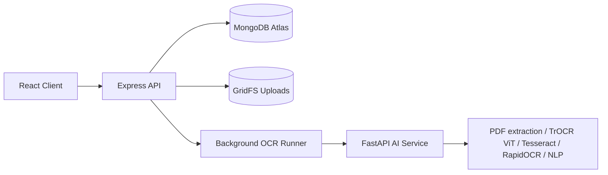

# PenBot AI Architecture

## Processing flow
Upload -> Save original in GridFS -> Mongo-backed OCR queue -> Structure detection -> Store editable blocks -> Edit -> Search/Export

Original PDFs/images are stored in MongoDB GridFS, so preview and retry OCR continue to work after server restart or redeploy.

OCR work is tracked by note status in MongoDB. On startup, interrupted `processing` notes are returned to `queued`, so the product can recover without Redis while still staying low cost.

The OCR engine is layered for real-world reliability:
1. Optional TrOCR/ViT handwriting recognition when `ENABLE_TROCR=true`.
2. Local Tesseract/RapidOCR fallback with preprocessing.
3. Optional OCR.space fallback only when `OCR_SPACE_API_KEY` is configured.
4. `MAX_PDF_PAGES` limits very large PDFs so one upload cannot consume all local OCR capacity.
